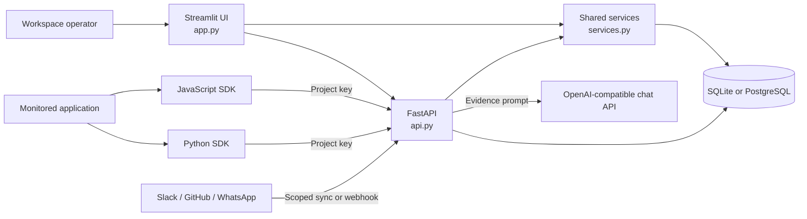
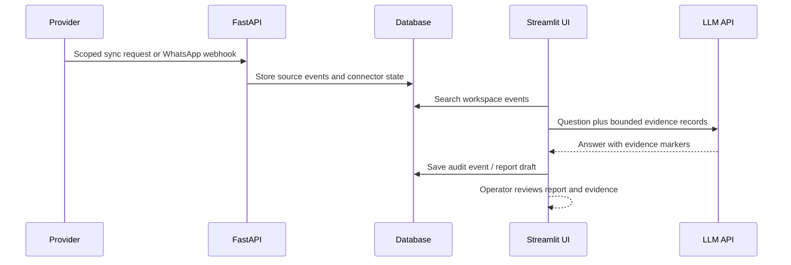
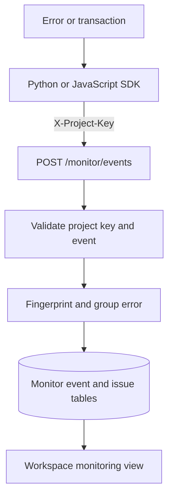

# Architecture

Secretary has two application surfaces over shared Python services and a relational database. The Streamlit UI is intended for a trusted workspace operator. The FastAPI service exposes administrative, assistant, connector, webhook, and monitoring endpoints.

## Main data paths

### Company activity and reports

### Application monitoring

The `api.py` process creates tables at startup for this MVP. Slack and GitHub synchronization is request driven; no scheduler or background worker is included. WhatsApp Business Cloud API events are accepted by the configured webhook. `sdks/` contains independent client packages and is kept separate from the root Python service modules.
